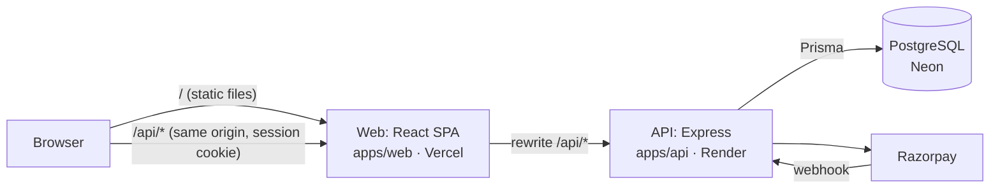

# Roopaank

D2C artificial/imitation jewellery store, built to production standards.

- Spec: [`docs/SPEC.md`](docs/SPEC.md)
- Sprint plan: [`docs/SPRINTS.md`](docs/SPRINTS.md)
- Rules for Claude: [`CLAUDE.md`](CLAUDE.md)

## Architecture



The browser only talks to the web origin; Vercel forwards `/api/*` to the API so the session cookie stays same-site. Layers inside the API and the reasoning: [`docs/SPEC.md` §5](docs/SPEC.md#5-architecture-build-1). Hosting decision: [§4.4](docs/SPEC.md#44-hosting-before-aws-decision-roo-2-2026-10-09).

## Repository layout

```
roopaank/
├── apps/
│   ├── web/              React SPA (Vite) — storefront + admin UI
│   └── api/              Express API — business logic, auth, payments
├── packages/
│   └── shared/           Code shared by web and api (Zod schemas, types, money helpers)
├── docs/
│   ├── adr/              Architecture Decision Records
│   └── runbooks/         Deploy, rollback and incident procedures
├── infra/
│   └── terraform/        Infrastructure as code (AWS, Sprint 10)
├── scripts/              One-off dev/ops scripts (seed admin, etc.)
└── .github/
    ├── workflows/        CI (ci.yml) and CD (deploy.yml)
    └── ISSUE_TEMPLATE/   Bug/feature templates
```

## Local setup

Prerequisites: **Node 22** (`.nvmrc`; e.g. `nvm use`), **npm**, **Docker** (for Postgres).

```bash
npm install                          # all workspaces; also runs `prisma generate`
npm run db:up                        # Postgres in Docker on localhost:5434 (dev + test databases)
cp apps/api/.env.example apps/api/.env
npm run db:migrate -w @roopaank/api  # apply migrations
npm run db:seed -w @roopaank/api     # 7 categories + 20 sample products
npm run dev:api                      # http://localhost:4000/api/health
npm run dev:web                      # http://localhost:5173
```

To create a local admin, set `ADMIN_NAME`, `ADMIN_EMAIL` and `ADMIN_PASSWORD` in `apps/api/.env`, then run `npm run admin:create -w @roopaank/api`. More API details: [`apps/api/README.md`](apps/api/README.md).

## Scripts

Run from the repo root.

| Script | What it does |
|---|---|
| `npm run dev:web` / `npm run dev:api` | Start the web app / API in watch mode |
| `npm run db:up` | Start local Postgres (Docker) |
| `npm run lint` | oxlint in every workspace |
| `npm run format` / `npm run format:check` | Prettier write / check |
| `npm run typecheck` | TypeScript in every workspace |
| `npm test` | All Jest tests (API tests need `db:up`) |
| `npm run test:coverage` | Tests with coverage report |
| `npm run test:e2e` | Playwright E2E (needs the app and API running) |
| `npm run audit:deps` | Dependency vulnerability gate (`audit-ci.jsonc`) |
| `npm run build` | Build shared → api → web |

API database scripts (`-w @roopaank/api`): `db:migrate` (create/apply migrations locally), `db:deploy` (apply only; used by CD), `db:seed`, `db:reset` (local only), `admin:create`.

## Environment variables

Templates with comments: [`apps/api/.env.example`](apps/api/.env.example). Copy to `.env` locally; **never commit `.env`**. The API validates its config with Zod at startup and refuses to start if anything is missing or invalid (it names the variable, never prints its value).

| Variable | Purpose |
|---|---|
| `NODE_ENV`, `PORT`, `LOG_LEVEL` | Runtime mode, port, log verbosity |
| `APP_VERSION` | Reported by `/api/health`; set to the git commit when hosted |
| `DATABASE_URL` | PostgreSQL connection string |
| `WEB_ORIGIN` | The only origin allowed by CORS and the CSRF origin check |
| `TRUST_PROXY` | Number of proxies in front of the API (0 locally) |
| `SESSION_TTL_DAYS` | Session cookie lifetime |
| `RAZORPAY_KEY_ID`, `RAZORPAY_KEY_SECRET`, `RAZORPAY_WEBHOOK_SECRET` | Razorpay keys (test mode outside production go-live) |
| `UPLOAD_DIR`, `PUBLIC_UPLOADS_URL` | Where product images are stored and served from |
| `ADMIN_NAME`, `ADMIN_EMAIL`, `ADMIN_PASSWORD` | Only for `admin:create` |

Hosted values live in Render (API), Vercel and GitHub environments (CD); see [`docs/runbooks/deploy.md`](docs/runbooks/deploy.md).

## Environments

| Env | Branch | URL | Deploy |
|---|---|---|---|
| Local | any | `http://localhost:5173` (web), `http://localhost:4000` (API) | `npm run dev:web`, `npm run dev:api` |
| Staging | `dev` | `https://roopaank-staging.vercel.app` (live after the first deploy) | Automatic on merge into `dev` |
| Production | `main` | `https://roopaank.vercel.app` (live after the first deploy) | On merge into `main`, after manual approval |

Hosting: Vercel (web) + Render (API) + Neon (Postgres), free plans (`docs/SPEC.md` §4.4). Setup, deploy flow and troubleshooting: [`docs/runbooks/deploy.md`](docs/runbooks/deploy.md). Rollback: [`docs/runbooks/rollback.md`](docs/runbooks/rollback.md).

## Branching workflow

Full rules: [`CLAUDE.md`](CLAUDE.md) → "Git, Branching & CI/CD".

```
feature/* ──PR──▶ dev ──(CI + deploy)──▶ staging ──QA──▶ PR dev → main ──(CI + approval)──▶ production
```

- `main` = production, `dev` = staging. Both are protected: no direct pushes, PRs only, CI must pass.
- Branch names: `feature/Roopaank-ROO-<n>-<title>`, `fix/…`, `hotfix/…` (hotfixes branch from `main`).
- PR title: `ROO-<n>: <summary>`. Commits: conventional (`feat:`, `fix:`, `docs:`, `ci:`, `chore:`…).
- CI on every push and PR: dependency audit → format → lint → typecheck → tests (with Postgres) → build.
- Tickets live in [`docs/SPRINTS.md`](docs/SPRINTS.md).
